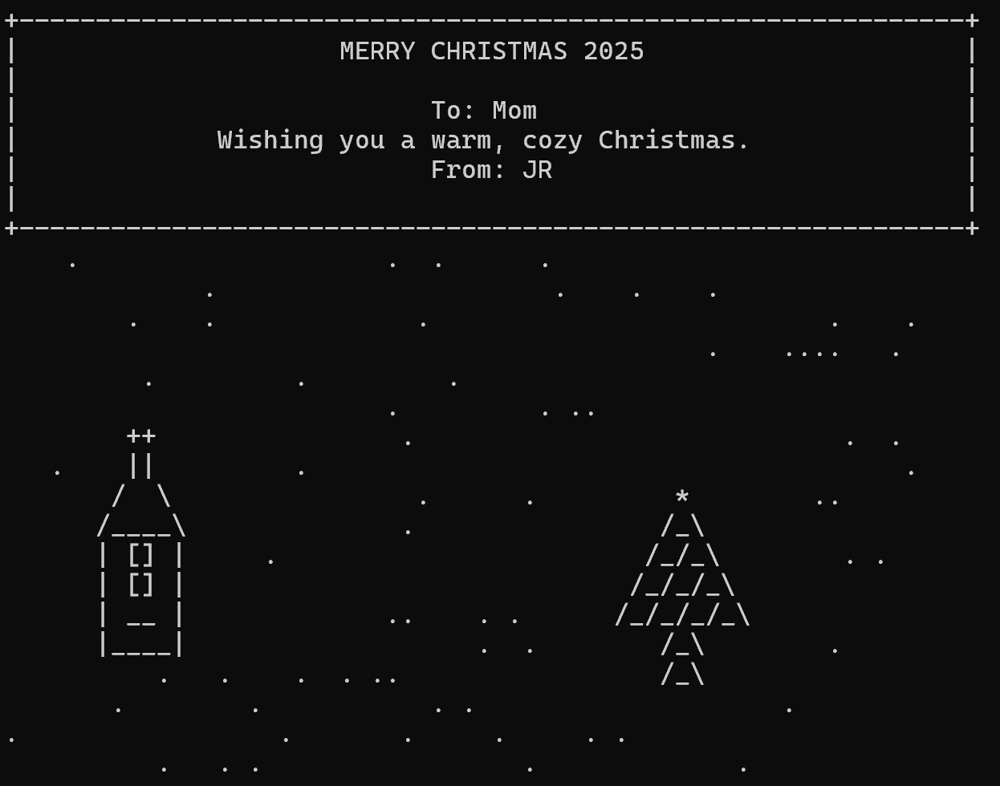

# ASCII Christmas Card Generator (C++)

A nostalgic, pure-C++ program that generates a winter scene with:
- a snowy ASCII landscape
- a church with a steeple
- a Christmas tree
- a custom user greeting

## Features
- Pure standard C++
- Random static snowfall
- Fully customizable text card
- ASCII art built with replace() logic
- Great example of string manipulation and procedural generation

## Usage
g++ main.cpp -o card
./card

## Example Output

## Why this exists
Teaching + holiday cheer + terminal nostalgia.
